<h1 align="center">Hi 👋, I'm Ridwane RAJOUL</h1>

<h3 align="center">Data Analyst & Full Stack Developer</h3>

  Passionate about Data Science, Machine Learning, Business Intelligence and Full Stack Development.

  

  

---

### 👨‍💻 About Me

- 🎓 I'm currently pursuing a **DUT in Decision Support Data Science** at EST
- 🌱 I'm currently learning **Data Science, Machine Learning & Full Stack Development**
- 🔭 I'm currently working on **MecaPro – Smart Car Maintenance Management Platform**
- 💬 Ask me about **Python, C++, Laravel, React, SQL, Power BI & Data Analysis**
- 📊 Interested in **ETL, Business Intelligence, Data Warehousing & Machine Learning**
- 📫 How to reach me: **[ridwanerajoul@gmail.com](mailto:ridwanerajoul@gmail.com)**

---

### 🚀 Featured Projects

#### 🔧 MecaPro – Smart Car Maintenance Management Platform

A full-stack garage management platform designed to digitalize garage operations.

**Features:**

- 🔧 Repair management
- 📦 Inventory management
- 🧾 Invoicing
- 👥 User & role management
- 🤖 AI-powered predictive diagnostics
- 💰 Repair cost estimation
- 📊 Interactive BI dashboards

**Tech Stack:** React • Laravel • Flask • Python • XGBoost • MySQL • Docker

#### 📊 ETL & Reporting – Decision Pipeline

- 🔄 ETL pipeline for heterogeneous data integration
- 🧹 Data cleaning and transformation
- 🗄️ Data warehouse modeling
- 📈 Interactive Power BI dashboards
- 📊 KPI monitoring and analytical reporting

**Tech Stack:** Talend • Power BI • SQL • MySQL

#### 📚 Library Management Application

- 🔐 Authentication and role management
- 📚 Book and loan management
- ✏️ CRUD operations
- 🏗️ MVC architecture
- 📱 Responsive user interface

**Tech Stack:** Laravel • PHP • MySQL • JavaScript

---

### 🛠️ Languages and Tools

---

### 📊 Data & Business Intelligence

- 🐍 **Python**
- 📊 **Power BI**
- 🔄 **Talend**
- 🗄️ **SQL / MySQL / PL/SQL**
- 🏗️ **Data Warehousing**
- 📈 **Data Visualization**
- 🤖 **Machine Learning**
- 🌳 **XGBoost**
- 🔧 **ETL**

---

### 🧠 Development

- 💻 **C / C++**
- 🐍 **Python**
- 🌐 **HTML / CSS / JavaScript**
- ⚛️ **React**
- 🐘 **PHP**
- 🚀 **Laravel**
- 🧪 **Flask**
- 🐳 **Docker**
- 🔌 **REST APIs**
- 🔧 **Git / GitHub**

---

### 📐 Modeling

- 📊 **UML**
- 🗂️ **Merise**

---

### 🌍 Languages

- 🇲🇦 **Arabic** — Native
- 🇫🇷 **French** — B1
- 🇬🇧 **English** — B2

---

### 🤝 Connect with me

---

### 📈 GitHub Stats

<h2 align="center">📈 GitHub Stats</h2>

  

  

<h2 align="center">🏆 GitHub Trophies</h2>

  

